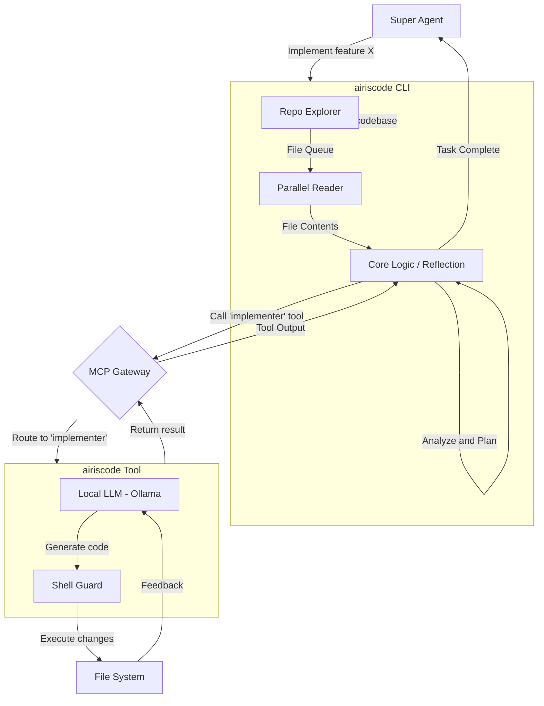

# AIRIS Agent Data Flow

This document outlines the data flow between the Super Agent, the `airiscode` agent, and the MCP (Multi-Capability Plugin) tools for code implementation, testing, and review.

## Architecture Diagram

The following diagram illustrates the workflow for a typical implementation task.

## Workflow Steps

1.  **Task Initiation**: A high-level task (e.g., "Implement a new feature") is given to the **Super Agent**.
2.  **Delegation**: The Super Agent delegates the implementation task to the **AIRIS Agent**, which is the primary intelligence running within the `airiscode` CLI.
3.  **Codebase Exploration**:
    *   The AIRIS Agent first invokes the **Repo Explorer** (`repo-mapper.ts`) to build a map of the repository, respecting user permissions for directory access.
    *   The explorer generates a queue of relevant files.
4.  **Parallel Data Loading**:
    *   The **Parallel Reader** (`parallel-reader.ts`) takes the file queue and reads the content of all files concurrently.
    *   This content is loaded into the agent's short-term memory for analysis.
5.  **Core Logic & Reflection**:
    *   The agent's **Core Logic** (`AgentExecutor`) processes the loaded information.
    *   It uses a reflection process to analyze the code, form a plan, and decide on the next steps. The loop-detection mechanism prevents it from getting stuck.
6.  **Tool Execution via MCP**:
    *   When the agent decides to write or modify code, it does not do so directly. Instead, it invokes a specialized tool like `"implementer"`, `"tester"`, or `"reviewer"` through the **MCP Gateway**.
7.  **Local Implementation**:
    *   The MCP Gateway routes the request to the appropriate tool running within the `airiscode` environment.
    *   The **Implementer Tool** uses a local, fine-tuned LLM (e.g., via Ollama) to generate the code changes.
    *   All file system modifications are passed through the **Shell Guard** for security and validation.
8.  **Feedback Loop**: The result of the tool execution (e.g., success, failure, test results) is sent back through the MCP Gateway to the AIRIS Agent's core logic.
9.  **Iteration**: The agent analyzes the feedback and continues the cycle of reflection and tool use until the task is complete.
10. **Completion**: Once the implementation is verified, the agent reports the final result back to the Super Agent.
